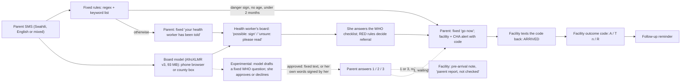

# SafetyNet-SMS

**When a child under five is seriously ill, a parent's text should reach someone who can act that night, and the clinic's answer should get back to the health worker who sent the child.**

## The problem

- **Children die of illnesses that can be treated if care comes in time.** Kenya's under-5 mortality rate is 41 per 1,000 live births (KDHS 2022). Pneumonia alone caused about 15% of under-5 deaths, almost 9,000 a year (2018 data; UNICEF/Save the Children, *Fighting for Breath*, 2020).
- **Delay is what kills.** In 74% of deaths of children aged 1 to 59 months studied at Kenya's CHAMPS sites (213 of 287), there was at least one delay in care (CHAMPS, *PLOS Global Public Health*, 2024).
- **Clinicians are scarce and often absent.** Kenya has 2.6 doctors per 10,000 people (WHO Global Health Observatory, 2024). On unannounced visits, 52.8% of health workers were absent, and 19.6% correctly diagnosed all four tracer conditions (World Bank / MoH Service Delivery Indicators, 2018 survey).
- **The first person a family can reach is a community health promoter (CHP)**, each responsible for about 100 households (Presidential address, 25 Sep 2023). She hears about a sick child only if the parent reaches her.
- **The parent's phone is usually a basic one.** Only 27.5% of rural Kenyan women own a smartphone (KDHS 2022). SMS is the channel that reaches every family, with no data bundle.
- **Many sick children never get advice or treatment.** For 3 in 10 under-5s with fever in the past two weeks, no advice or treatment was sought, even counting shops and drug sellers (KDHS 2022: sought for 69.5%).
- **Referrals disappear.** In one Kenyan sub-county, referral forms were on file at the hospital for only 19 of 112 children referred for pneumonia (Opuba et al., 2025). In a Kenyan young-infant programme, heavy workload led some facility staff to skip the feedback form, so health volunteers relied on what caregivers told them (Odwe et al., *Health Policy and Planning*, 2024).

Every figure, with its table or page and URL: [DATA.md](DATA.md#1-problem-evidence-kenya-unless-stated), section 1.

## How SafetyNet-SMS fixes it

1. **A parent texts from any phone,** in Swahili, English or both. Fixed rules built from the WHO/UNICEF danger signs reply within seconds. When a danger sign is present, the parent is told to go to the clinic now, with a code, and the facility and the supervisor are alerted, even at 2 a.m. when the health worker is asleep.
2. **A small AI model reads every message** (AfroXLMR, 93 MB; designed to run on the health worker's phone, and it ran offline in a phone browser). It puts the urgent cases at the top of her board and catches danger signs the keyword rules miss: on a fresh sealed test set, the board flagged 12 of the 14 danger messages the rules missed (AI-written test messages; exploratory). It never sends anything to a parent on its own.
3. **The health worker decides.** She answers the WHO checklist by number, and she can send a question the model suggests, only after she approves it. The parent's answer reaches the clinic before the child does (experimental).
4. **The loop closes.** The facility texts the code back when the child arrives and a short outcome code after the visit. Her follow-up visit is set from it, and the referral record (referred, arrived, outcome) is written for her instead of adding reports for her to send. It is designed to feed Kenya's eCHIS and KHIS (DHIS2); that integration isn't built.
5. **It is cheap.** A danger-sign case, from the first text to the clinic's outcome, costs about 11 billed SMS (10 messages), around 13 Kenyan shillings (roughly 10 US cents).

**Honest status:** our pre-registered test on native Swahili messages could not run (no native speaker's texts were ready), so the claim stays NOT TESTED. Every result here is on AI-written test messages. Not for medical use.

Video: {link}

> **For judges.** Click first: the live demo, https://huggingface.co/spaces/ranbirr1/safetynet-sms, then **Play the story** (three stories, a minute each; "Show English" puts our English under Swahili messages). **Not for medical use**: synthetic data, no real patients, no SMS gateway. **AI-written:** every test message, the training data and the story messages (team-written, AI-assisted); the Swahili parent texts are machine translations approved by the team, not reviewed by a native speaker. **Experimental:** the questions a health worker can approve for a parent (Tier 1 and Tier 2, below); not evaluated.
>
> Files: [PREREGISTRATION.md](PREREGISTRATION.md) · [DATA.md](DATA.md) · [results/TABLES.md](results/TABLES.md) and [results/ERRATA.md](results/ERRATA.md) · model card: https://huggingface.co/ranbirr1/safetynet-sms-board · [LICENSE](LICENSE)

## Test it offline (judges)

### In your browser, 2 minutes, no install

This runs the board model only, inside the browser.

1. Open https://ranbirr1-safetynet-sms.hf.space/phone and wait for **Model: ready (92.7 MB)** (about 5 to 7 seconds on a fast connection).
2. Turn on airplane mode or switch Wi-Fi off. **Network** changes to **Offline**.
3. Type a parent's message and press **Read**, for example Amina's "kila kitu anachokula anatapika hata maji" (everything they eat, they vomit, even water). You'll see "model: possible vomits everything, check". Try "mtoto wangu wa miezi 18 ana degedege" (convulsions) or an English message.
4. Press **Time 50 messages** for the speed: p50 and p95 in ms.

Limits:
- Don't reload the page while offline. The page itself isn't cached, so a reload fails until you reconnect.
- A fast phone or laptop is a best case. Not yet measured on an entry-level Android.
- This is the model only. The full SMS workflow (rules, replies, alerts, arrival) needs the server below.

We tested this on the live Space, in desktop Chrome and in a 390x844 phone emulation, with the browser set offline after loading:
- Reading messages made 0 network requests.
- The status line read "Offline".
- p95 was 161 to 166 ms.
- "Time 50 messages" tries once to send its timing to the server. The attempt fails offline and nothing else changes.

### The whole system on your computer, about 5 minutes

You need Python 3.11, git, about 400 MB of disk and about 1 GB of free RAM. The server used 243 MB on a Windows laptop after the three stories and peaked at 569 MB on the Raspberry Pi. No GPU.

Windows (PowerShell). Clone to a short path such as `C:\sns`, because pip fails on onnxruntime's deep file paths under a long folder:

```
git clone https://github.com/ranbirdaefler/SafetyNet-SMS C:\sns\SafetyNet-SMS
cd C:\sns\SafetyNet-SMS
py -3.11 -m venv .venv
.venv\Scripts\activate
pip install -r requirements-demo.txt
python scripts/fetch_model.py   # once, with internet: board model 92.7 MB, SHA-256 checked
python -m app.check              # step 0: load the protocol, run T1-T35, CG1-CG18 and the lints
# now disconnect from the internet
python -m uvicorn app.server:app --port 8000
```

macOS / Linux. Same steps; we ran them on Windows 11 only:

```
git clone https://github.com/ranbirdaefler/SafetyNet-SMS && cd SafetyNet-SMS
python3.11 -m venv .venv && source .venv/bin/activate
pip install -r requirements-demo.txt
python scripts/fetch_model.py   # once, with internet
python -m app.check
# now disconnect from the internet
python -m uvicorn app.server:app --port 8000
```

Open http://localhost:8000 and press **Play the story**. Nothing leaves your machine, and the SMS gateway is simulated. Tests: `python -m pytest checks`. On the Pi: `sh scripts/pi_run.sh`.

We checked this from a fresh clone (commit e4c4138):
- We ran it with HF_HUB_OFFLINE=1.
- The browser blocked every non-localhost request. All three stories played to the end with 0 external requests and no page errors.
- The board model ran: the Amina message was marked "possible" in 89 ms.
- A code search found every page request goes to the same local server. The only outbound call in the code is `scripts/fetch_model.py`, which downloads the model once from Hugging Face.

In deployment the model would run on the health worker's phone (designed, not built as an app) or on a county box behind the SMS number.

> SMS gateway simulated. In deployment: a county shortcode on a Kenyan SMS gateway, with this code on the health worker's phone or a county box. Synthetic cases; not clinically validated.

| | |
|---|---|
| **What it does** | An assistant for Kenya's community health promoters (CHPs) that closes the referral loop by SMS: a parent texts about a sick child (2 to 59 months, Swahili, English or both); the rules say "go now" when a WHO danger sign is present and alert the facility and the supervisor (CHA); the facility texts a code when the child arrives and a short outcome code after the visit; the health worker's follow-up is set from it. She makes every clinical call; the automatic "go now" is a safety net when she is on a visit or asleep, not a replacement for her. |
| **What the AI does** | One model (AfroXLMR-base fine-tuned, v3, 93 MB) reads every parent text and sorts the health worker's board, so she reads the urgent ones first. Automatic replies to parents come only from fixed rules. The model never sends anything to a parent on its own: a question it suggests reaches a parent only after the health worker approves it (experimental). |
| **What the rules do** | Every automatic message to a parent and every referral: fixed, checkable rules from the WHO/UNICEF danger signs, editable by the ministry and tested on every load. |
| **What's experimental** | Questions to parents: the model suggests a fixed WHO question; nothing is sent until the health worker approves it. |
| **What was tested** | AI-written test sets (GPT for training, Claude for tests) and an iPhone browser. NOT TESTED: real parents' messages, native Swahili, an entry-level Android phone, Kikuyu or Luo. See [What our data does not cover](DATA.md#4-what-our-data-does-not-cover). |

**Problem statement (brief template).** Because of this tool, a community health promoter will see a sick child's danger signs within minutes of the parent's text, and will learn whether the child reached the clinic and what the clinic decided, which today often depends on what the caregiver tells her; we know because 74% of child deaths studied at Kenya's CHAMPS sites involved at least one delay in care, and in one Kenyan sub-county, referral forms were on file at the hospital for only 19 of 112 children referred for pneumonia (DATA.md: P3, P8; Odwe et al. 2024).

**Stack.** Python 3.11, FastAPI/uvicorn, SQLite, ONNX Runtime (Raspberry Pi) and onnxruntime-web (phone browser); AfroXLMR-base fine-tuned, 8-bit weight-only, 92.7 MB; Raspberry Pi 5; a Hugging Face Space for the public demo.

Designed to sit alongside eCHIS on the health worker's government phone; integration not built this weekend. eCHIS records her visits; this assistant reads parents' SMS, flags danger signs, and writes the referral and arrival record for her instead of adding reports for her to send.

World Bank / Hack-Nation *Small AI for Development* hackathon, health track, 3 to 4 October 2026.

> **Results at a glance.** Pre-registered test: the model tied a keyword list (20 against 20 danger messages missed), so fixed rules talk to parents. After retraining (exploratory; one evaluation on a fresh sealed set): rules plus the model's board (rules as frozen) left 2 of 80 danger messages unflagged and flagged 2 of 55 harmless messages, and 1 of 1,012 everyday Swahili sentences it never trained on. All test messages are AI-written; native Swahili is not tested. Device: 93 MB model, offline in a phone browser: 165 ms (iPhone, best case; not yet measured on an entry-level Android). Raspberry Pi 5, 1 core: 215 ms. Cost: on our older test sets v3 let through 3 of 104 danger messages the first retrain caught, mostly long illnesses described in Swahili; it is very sure of itself; how often it would flag real parents' messages is unknown.

## Try it in 60 seconds

Live demo: https://huggingface.co/spaces/ranbirr1/safetynet-sms (synthetic data, not for medical use; it runs a tagged release of this repository on a cloud server; the final one is the `submission` tag). Press **Play the story** and pick one; each step waits for you to press Next. The messages were written by the team (AI-assisted) and appear in no test set; they are examples, not evidence.

1. **The rules miss it. The model and the health worker catch it.** Amina writes "kila kitu anachokula anatapika hata maji" (everything they eat, they vomit, even water): the keyword rule looks for "anatapika kila kitu", so it misses the different word order and she is told her health worker has been told. The model flags "possible: vomits everything" and drafts a fixed WHO check; Achieng approves it; Amina replies 1 and gets "go now" at once, with the facility alerted ("parent report, not checked"). The facility sends the code back (arrived), then `T5` (treated, follow-up day 5).
2. **Clear danger: go now, and the clinic is ready.** Zawadi reports convulsions ("degedege"): "go now" at once. The model drafts two pre-arrival questions, crediting the rule that found the sign; Achieng approves one, Zawadi answers, and the facility gets a pre-arrival note. Achieng declines the other draft, tries a message with "usijali" (don't worry), which is refused, removes it, and her message goes out signed as hers after the fixed "Keep going to the clinic.". Zawadi's reply is shown to her as written, never read automatically.
3. **Not every cough is an emergency.** Akinyi's child has had a cough for 3 days, "hana homa" (no fever), and is eating and playing: no alarm and no model flag, and no checks are suggested, because there is no danger signal (the cough has a duration under the cut-off and the fever is denied). Achieng checks the child herself and replies "0": the case closes with a check-in in 3 days.

Or type your own messages in the three panes. **Show English** (on by default) adds a grey line with our own English under Swahili system messages and the story messages; anything you type yourself is not translated. **show message IDs** reveals the internal message names (CG_TOLD, Q_ACK, ...). Questions to parents are an experimental layer (below).

## How it works



Designed to run on her phone: the same model ran offline in a phone browser; no phone app was built. Where phones fail, the same model runs on a county box behind the SMS number. That box is what we demoed. The parent still gets "go now" and the facility is still alerted when her phone is off or broken.

- **Two readers, one message.** Every parent text is read twice, locally, with no internet. Fixed rules (regex + keyword list from the WHO/UNICEF danger signs) decide the parent's instant reply and any referral; they can be checked line by line, so they talk to parents. The board model (AfroXLMR-base fine-tuned, v3, 92.7 MB, 8-bit) reads the same text and adds one band to her board; it never changes what the parent is told, sends no SMS and changes no case status (tested: the parent reply is identical with the model on and off). Automatic replies to parents come only from fixed rules. The model never sends anything to a parent on its own: a question it suggests reaches a parent only after the health worker approves it (experimental). Why both: on a fresh sealed set, the board flagged 12 of the 14 danger messages the rules missed (rules as frozen; exploratory; AI-written test messages; see Results).
- **One endpoint.** `POST /sms {from, to, body}`; the role (parent, health worker, facility) comes from the number texted. A 3-pane web simulator (Parent / Health worker / Facility + CHA) is the demo client. A gateway adapter (Africa's Talking or a county shortcode in Kenya) is a thin mapping onto this endpoint and is not built.
- **Parent line.** The rules answer with one of five fixed messages: go now, go now (unregistered number), your health worker has been told (with a waiting time in minutes and the danger-sign list), the health worker did not reply (go now), or not for this number. The only other texts a parent can get come from the experimental question layer: a fixed bank question the health worker approved, a fixed acknowledgement, or her own message signed with her name (below). A parent never gets model-written text, advice, reassurance, a diagnosis, a medicine or a dose. A send-time check refuses any other text to a parent.
- **Health-worker line.** Deterministic. The parent's texts are read on the parent line (above); on this line her numbered replies answer the checklist, and any other text she sends (a child she reports herself, or a note on an open case) is read by the same regex and keyword list for signs that are present; nothing is ever read as absent, and text inside an open case can only add a sign. The model never reads her texts. The health worker gets the full 8-option checklist and only a numbered reply ("0") clears a sign. Any sign, "9", silence or two unreadable replies refer.
- **Case board.** In the health-worker pane: her cases with code, age, a danger flag, the signs recorded, status (to check / referred / no reply / arrived / closed) and time. Rule-flagged danger first, then model 'possible', then model 'unsure', then the rest, oldest first within each group. Model lines are fixed band words, never generated text. Built only from stored case records; nothing generated. After an arrival it shows "follow-up visit due {date}", after she closes a case with "0" "check on child due {date}" (3 days, WHO/UNICEF CHW manual pp.98 and 116); these say only when to go back and are never sent as SMS.
- **Referral loop.** Every referral sends an alert with a 4-digit code to the facility and the community health assistant (CHA). The facility texts the code on arrival; the health worker and CHA are told the child arrived. The facility owns the arrival code. No reply to a code means it was not recorded: resend. **Counter-referral:** after arrival, a registered facility number can text the code with an outcome: `A` (admitted), `T` and a number of days 1 to 30 (treated, sent home, e.g. `T5`) or `R` (referred on). The health worker and CHA are told; the parent is never messaged; codes only (any other text is read as before). The follow-up reminder is never removed: `T5` moves it to day 5, `A` and `R` keep the 3-day check-in. In a Kenyan young-infant referral programme, heavy workload led some facility providers to skip the MOH-100 form that served as feedback to referring CHVs, so CHVs relied on caregivers' verbal reports (Odwe et al., 2024). In Mozambique, CHWs and supervisors saw lack of feedback as a barrier (Give et al., 2019). Some CHWs there already send feedback informally by SMS and phone (Give et al., 2019); our outcome codes make that structured and tie it to a follow-up reminder.
  - Odwe G, et al. Health Policy and Planning 2024;39(1):56-65. doi:10.1093/heapol/czad113 (Results, "Inadequate providers"). PMC10775218.
  - Give C, et al. BMC Health Services Research 2019;19:263. https://pmc.ncbi.nlm.nih.gov/articles/PMC6489304/ (Discussion; Results, "Pragmatic problem-solving approach").
- **Referral record.** The Facility + CHA pane counts referred, arrived and outcome (A / T n / R) cases and the median time to arrival for the demo session, and downloads them as CSV (code, dates, community unit, age, reason, outcome; no names or phone numbers). Column names chosen for a DHIS2 mapping; not tested against DHIS2.
- **Play the story.** A button in the simulator plays one of three fictional cases in user-paced steps (it advances only when you press Next), sending team-written messages through the same `/sms` endpoint as any other text.
- **Rules.** `config/protocol.yaml` holds the RED (refer) rules from the WHO/UNICEF community case management materials, editable by the ministry. Must-stay-RED tests (T1 to T35, T34 retired) and caregiver tests (CG1 to CG18, CG16 retired) run on every load: a protocol edit that drops a RED rule is refused, and any red caregiver test switches the parent door off.

### The model on the health worker's board

The model reads every message and puts the urgent ones in front of the health worker. Automatic replies to parents come only from fixed rules. The model never sends anything to a parent on its own: a question it suggests reaches a parent only after the health worker approves it (experimental). It sorts the health worker's cases and marks the ones it is unsure about for her to read first.

It reads parent text only and adds one of three board lines, from its calibrated top danger probability: "model: possible {sign}, check" (at or above hi), "model unsure: please read" (between lo and hi), or nothing (below lo). The board sorts rule-flagged danger first, then "possible", then "unsure", then the rest, oldest first within each group. It sends no SMS and changes no case status; a model failure just leaves no model line. Tested: the parent reply is identical with the model on and off (CG1 to CG18 both ways).

Until v3 (below), the board ran v2, vocabulary-trimmed with 8-bit weights (89.7 MB). Calibration: one temperature per head, fit on X-val (held out from the GPT-written training data; never Y-dev or a test set):

| Head | Temperature | ECE before | ECE after |
|---|---|---|---|
| convulsions | 0.6 | 0.0477 | 0.012 |
| not_drink_feed | 0.25 | 0.0319 | 0.0 |
| vomits_everything | 0.35 | 0.041 | 0.0039 |
| sleepy_unconscious | 0.6 | 0.0382 | 0.0103 |
| blood_stool | 0.65 | 0.043 | 0.0127 |
| cough_long | 0.4 | 0.0585 | 0.0105 |
| diarrhoea_long | 0.5 | 0.0593 | 0.0243 |
| fever_long | 0.6 | 0.0502 | 0.0127 |

Thresholds, set on Y-dev (GPT-written): lo = 0.068 (the lowest Y-dev danger score: no Y-dev danger message falls below it), hi = 0.9 (see the decision below the table). Sweep on Y-dev:

| lo | hi | Y-dev messages sent to "please read" | Y-dev danger messages below lo (of 60) | Y-dev no-danger marked "possible" (of 45) |
|---|---|---|---|---|
| 0.068 | 0.9904 (data-driven) | 30.8% | 0 | 0 |
| **0.068 (chosen)** | **0.9 (chosen)** | **12.5%** | **0** | **2** |
| 0.01 | 0.9 | 13.3% | 0 | 2 |
| 0.01 | 0.95 | 16.7% | 0 | 2 |
| 0.1 | 0.9 | 10.0% | 1 | 2 |
| 0.1 | 0.95 | 13.3% | 1 | 2 |
| 0.2 | 0.9 | 9.2% | 1 | 2 |
| 0.2 | 0.95 | 12.5% | 1 | 2 |
| 0.5 | 0.9 | 5.8% | 2 | 2 |
| 0.5 | 0.95 | 9.2% | 2 | 2 |

Board threshold hi = 0.9 (chosen on Y-dev before the freeze, Sat 3 Oct). At hi = 0.9904, no Y-dev no-danger message was marked 'possible', but 30.8% of messages went to 'please read' and 'possible' almost never fired. At hi = 0.9, review load falls to 12.5%, at the cost of 2 of 45 Y-dev no-danger messages marked 'possible'. On the board a false 'possible' only moves a case up the health worker's list: no SMS is sent and no case status changes. A review load of about a third of all messages risks the health worker ignoring the flags (mTrac's on-time volunteer reporting fell from 60% to 9%; DFID 2014 via SDSN TReNDS 2018). lo = 0.068 is unchanged, so no Y-dev danger message falls below it. The full sweep is in the table above.

### v3 on the board (after results, exploratory)

The board now runs **v3**, a third training run made after the results were tabulated. Its criteria, splits and threshold rule were committed before any v3 data or training (`v3/CRITERIA.md`), and it was evaluated once, together with v2, on splits it had never seen. The parent line is unchanged: the keyword list still decides what the parent is told.

v3 added, to the v2 training data: gpt-5.5 contrast pairs (the same message with a sign present and denied, extra "very sleepy" denials), duration messages under the cut-offs, human-written Swahili with no health content as no-danger examples (MASSIVE sw-KE train and AfriSenti swa train), and SMS-style noise. v3 includes AfriSenti training data; a ministry deployment would retrain without it or seek the creators' approval.

Results after the pre-registered tests (exploratory). The pre-registered model tied the keyword list, 20 missed danger messages each across the three sealed sets, and missed one more on two of them, so under the pre-registered safety rule the keyword list runs the parent line. Two retrains followed. v2 caught more danger messages than the pre-registered model but flagged 62.6 to 80.5% of everyday Swahili sentences. v3 was evaluated once on a fresh sealed set of 150 AI-written messages. It kept the board's catch rate (keywords + board missed 2 of 80 danger messages, the same number as v2, though not the same messages) while flagging 2 of 55 harmless messages (v2: 18) and 1 of 1,012 FLORES sentences it never trained on (v2: 70.6%). The cost: on the three older sets, keywords + v3 board let through 3 of 104 danger messages that the v2 board caught, mostly long illnesses described in Swahili. The keyword rules missed these too; they were extended afterwards for Swahili durations (post-hoc, not evaluated on sealed data). v3's training changes were chosen after seeing error types on dev data and, report-only, on those older sets, so only the fresh set is a clean test of v3. On its own (p ≥ 0.5), v3 missed fewer danger messages than the keywords on every set, with no more needless trips; even so, it doesn't talk to parents until it has been tested on real parents' messages. All test messages are AI-written; native Swahili is NOT TESTED. Board numbers use lo 0.849 / hi 0.997, set by the rule committed before evaluation.

| Evaluation split (never used for training or thresholds) | Keywords + v2 board (as shipped) | Keywords + v2 board (re-tuned) | Keywords + v3 board |
|---|---|---|---|
| Fresh test set y_test2 (Claude-written, 80 danger): danger missed | 2 | 2 | 2 |
| y_test2 (55 no-danger): flagged by the board | 18 | 18 | 2 |
| Everyday Swahili, MASSIVE test (1,000): flagged | 62.6% | 62.6% | 0.0% |
| Everyday Swahili, FLORES-200 devtest (1,012; FLORES was never trained on): flagged | 70.6% | 70.6% | 0.1% |
| Everyday Swahili, AfriSenti test (748 tweets): flagged | 80.5% | 80.5% | 0.0% |

v3 trained on the train splits of MASSIVE and AfriSenti, so those two rows are in-domain; FLORES (never trained on) is the clean check. None of these are parents' messages about sick children.

The model on its own (parent-line rule, p >= 0.5; exploratory), danger missed / needless go-now:

| Set | v3 alone: missed | Keywords: missed | v3 alone: needless | Keywords: needless |
|---|---|---|---|---|
| (a) grid | 1 / 12 | 4 / 12 | 2 / 13 | 2 / 13 |
| (b) Swahili | 1 / 12 | 2 / 12 | 1 / 13 | 3 / 13 |
| Y-test | 0 / 80 | 14 / 80 | 7 / 55 | 11 / 55 |
| y_test2 (fresh) | 1 / 80 | 14 / 80 | 7 / 55 | 11 / 55 |

Thresholds behind each column: v2 as shipped lo 0.068 / hi 0.9; v2 re-tuned lo 0.068 / hi 0.844 (same rule as v3); v3 lo 0.849 / hi 0.997. A message counts as flagged when the board marks it 'possible' or 'unsure'. "Alone" figures use p ≥ 0.5, the pre-registered PRESENT rule, never tuned.

### Questions approved by the health worker (experimental, after results)

On in this release, labelled experimental (`config/questions.yaml`, `enabled`; `SNS_QUESTIONS=0` switches it off); not evaluated; needs clinical and native-speaker review before any use. Tier 1: questions **before arrival, on cases already referred**. Tier 2: checks on cases still waiting for the health worker (below).

- **Who does what.** Knowledge: a fixed question bank drawn from the WHO/UNICEF community case management manual, ministry-editable and checked on load (3 options, option 1 always the danger state, 1 SMS in pure GSM-7, no medicine, advice or diagnosis words; a failing bank switches the layer off). Selection: on a referred case, at most two pre-arrival questions linked to the sign that triggered "go now", whose reason credits the rule and the word it matched ("Linked to the sign the rules found: convulsions ('degedege')"); on a waiting case, the checks described below. A model score is shown only when the model ranked the question, never below 0.5. Judgment: the health worker approves or declines each one; nothing reaches a parent without her tap, and every suggestion is logged ("drafted by model, approved/declined by CHP 07").
- **Safety rules** (clinical-safety review M1-M8): no drafts for under 2 months, no age, 5 years or older, pregnancy, adults or unregistered numbers; every message on a referred case starts with the fixed line "Keep going to the clinic. Do not stop to reply."; sending a question is never her reply and never moves a deadline; a parent's answer can only add information: 1 (danger) and 3 (not sure) go to the facility as a pre-arrival note marked "parent report, not checked", 2 goes to her board as "not a check, you still check", and no answer clears a sign; only a bare 1/2/3 (or moja/mbili/tatu) counts, anything else counts as "not sure" and the usual flow runs. One question is out at a time: a question she approves while another is unanswered is queued and sent automatically after the parent answers (her approval already given); she can cancel it; the queue lapses after 12 hours or when the case closes or the child arrives, and is cleared when a waiting case turns into "go now". Within 12 hours a later bare digit may only raise urgency (2 to 1, 2 to 3, 3 to 1): the answer is updated and the facility gets a note marked "answer changed"; a lower digit is ignored and shown to her.
- **Her own words** (review E1-E6): she can edit a suggested question or write her own message on a referred case she owns, to a registered number only. The system adds the fixed first line "Keep going to the clinic." and her name ("Achieng, your health worker: ..."); she cannot remove either, and the whole SMS must fit one segment. Messages with medicine or dose words, words that could cancel a referral (wait, tomorrow, subiri, usiende, kesho, ...) or reassurance (don't worry, usijali, ...) are refused with "Not sent: for medicines or a change of plan, call the parent." (English and Swahili lists, both applied to every message). Her message ends automatic reading of any earlier question; the parent's replies to it are shown to her exactly as written and are never interpreted or forwarded, and the usual flow still runs (a referred parent gets "go now" again). At most 3 messages per case in all. Model-written text never reaches a parent.
- **Tier 2: checks while she hasn't seen the child yet** (review M2, M4, M7, M8, E7). On a case waiting for her, fixed checks are drafted as described in the next point (signs already recorded are skipped; the drink check only after the wake check), and she approves each one. Answer 1 records the sign and the usual "go now" goes out first, with no acknowledgement before it; 3 (not sure) on fits, drinking, vomiting or waking also means "go now"; 3 on blood or a duration puts "Parent not sure: ... Call now." on her board and keeps the deadline; 2 changes nothing and is never a check. The acknowledgement restates the deadline as minutes left ("within {minutes} minutes"). A danger answer up to 12 hours later still goes now, even after she closed the case with "0". A parent's reply to her own message on such a case puts "PARENT REPLIED: read now" on her board and texts her; the keyword rules and the deadline still run underneath.
- **Which checks are drafted** (review Addendum B): only with a signal. Model scores of 0.5 or more come first; then a symptom the parent mentioned and did not deny links to fixed checks (diarrhoea: wake-then-drink, blood, how long; fever: wake-then-drink, fits, how long; vomiting: vomit, wake-then-drink; cough: how long only). The wake-then-drink pair counts as one slot; at most 2 slots per case (at most 3 SMS). No signal, no draft. A reviewed option not adopted: drafting the wake-then-drink pair whenever any symptom is mentioned.
- **Swahili to be reviewed by a native speaker:** every Swahili text a parent can receive is a machine translation (gpt-5.5) with a back-translation check, approved by the team: the five fixed messages (go now, go now unregistered, told, timeout, not for this number), all question texts, both acknowledgements and the "Keep going to the clinic" line. In particular "ananywa" (standard "anakunywa") in the drink check, "degedege" for fits, and the duration wording.
- **Cost:** +1 SMS per question, +1 per acknowledgement, +1 per facility note (each 1 segment).
- The Swahili question texts are machine translations (gpt-5.5) with a back-translation check, approved by Florian, not reviewed by a native speaker.

## Runs on a phone-class device

Designed to run on the health worker's own phone, with no internet or data bundle; SMS is the only channel. Tested: the same model runs offline in an iPhone browser; not yet measured on an entry-level Android; no phone app built. Where her phone fails, the same model runs on a county box behind the SMS number: still no internet, but a shared local server rather than her device. In this demo a Raspberry Pi plays both roles.

> The same 93 MB model runs offline in a phone browser (iPhone, Safari: p95 165 ms; a best case, since entry-level Android phones are slower). Raspberry Pi 5 limited to 1 core: the model answers in 215 ms (p95); a full round trip through the demo service takes 530 ms. Peak memory: model 350 MB; whole demo service 569 MB, which also holds the earlier pre-registered model and the web simulator; a phone app would carry neither. Not yet measured on an entry-level Android; no phone app was built this weekend.

The service also loads the earlier pre-registered encoder (v1) at start-up only to run the caregiver tests with it switched on; it failed them, so it is never used, and the parent line stays on the keyword list. It never affects what a parent or health worker sees.

**In a phone browser (P4).** The board model (v3, trimmed, 8-bit weights, 92.7 MB) runs in Safari on an iPhone, single-threaded WebAssembly (onnxruntime-web 1.30), served once from the Pi over the local network with no CDN: 50 Y-dev messages p50 110 ms, p95 165 ms; model load 1.3 s (the v2 file, 89.7 MB, measured p50 109 ms, p95 170 ms) (user agent `Mozilla/5.0 (iPhone; CPU iPhone OS 18_7 like Mac OS X) AppleWebKit/605.1.15 (KHTML, like Gecko) Version/18.7.5 Mobile/15E148 Safari/604.1`). Parity with the Pi on 20 Y-dev messages: tokens 20/20, head flags 20/20, board bands 20/20, largest probability difference 0.021. With the v3 file on the same iPhone (posted back to the Pi, 16:27): tokens 20/20, head flags 20/20, board bands 20/20, largest probability difference 0.021; desktop Chrome gave the same. With airplane mode on and Wi-Fi off the status line read "Offline" and typed messages were still read. Works offline once loaded; a reload needs the network (no HTTPS service worker in this build). The tokenizer is a small JavaScript Unigram implementation of the same `tokenizer.json`.

**Pi limited to 1 core (headroom).** With the v3 board file: model alone, 1 core, p95 215 ms at 64 tokens; peak model RSS 350 MB; 50 Y-dev parent messages end to end p50 404 ms, p95 530 ms; whole service peak RSS 569 MB. An earlier run with the v2 file (full service pinned to one core with `taskset -c 0`): p50 397 ms, p95 516 ms, max 718 ms; peak RSS 549 MB. The 2 GB memory cap (`systemd-run --user -p MemoryMax=2G`) was not enforced: this Pi's user session delegates only the cpu and pids cgroup controllers, and a system scope needs root. Note: the 2 GB cap could not be enforced without root (the cgroup memory controller is not delegated to the user session); peak RSS was measured instead.

The parent line runs the keyword list live. The board runs v3 live; caregiver tests T1-T35 and CG1-CG18 pass with it on. The tables below are the v1 size sweep that chose the trim + 8-bit recipe v3 reuses.

### What fits on which phone, and what it costs

All variants come from the same fine-tuned v1 model. Size = model + tokenizer on disk. Peak RAM, cold load and p95 per message (64 tokens) measured on the Pi 5 with ONNX Runtime (4 cores, and pinned to 1 core with `taskset`). Accuracy on Y-dev (GPT-written development set, 120 messages: 60 danger, 45 no-danger), never on a test set. Rule: deploy the smallest variant with >= 99% go-now agreement with FP32 on Y-dev and no danger message missed that FP32 catches.

| Variant | Size MB | Peak RAM MB | Load s | p95 ms, 4 cores | p95 ms, 1 core | Danger caught | False go-now | Agrees with FP32 | Danger missed vs FP32 | Passes |
|---|---|---|---|---|---|---|---|---|---|---|
| FP32 (registered default) | 1074.9 | 1851 | 2.2 | 126.0 | 373.2 | 56/60 | 6/45 | 120/120 | 0 | yes |
| INT8 dynamic, MatMul only (registered INT8) | 832.1 | 1610 | 1.75 | 44.4 | 116.8 | 26/60 | 3/45 | 87/120 | 30 | no |
| INT8 dynamic, MatMul only, per-channel | 832.5 | 1611 | 1.78 | 46.0 | 119.8 | 49/60 | 6/45 | 113/120 | 7 | no |
| INT8 dynamic incl. embeddings (Gather) | 281.6 | 625 | 1.21 | 45.7 | 117.2 | 27/60 | 4/45 | 89/120 | 29 | no |
| INT8 weight-only (per-channel), FP32 compute | 283.1 | 1432 | 1.47 | 182.1 | 317.3 | 56/60 | 6/45 | 120/120 | 0 | yes |
| Vocab trim (9,759 tokens), FP32 | 355.4 | 490 | 0.82 | 158.4 | 364.6 | 56/60 | 6/45 | 120/120 | 0 | yes |
| Vocab trim + INT8 dynamic, MatMul only | 112.6 | 252 | 0.4 | 46.0 | 116.9 | 26/60 | 3/45 | 87/120 | 30 | no |
| Vocab trim + INT8 dynamic incl. embeddings | 90.0 | 228 | 0.39 | 45.6 | 117.7 | 28/60 | 4/45 | 90/120 | 28 | no |
| Vocab trim + INT8 weight-only (per-channel) | 90.3 | 322 | 0.63 | 86.3 | 215.9 | 56/60 | 6/45 | 120/120 | 0 | yes |
| Keyword list E2 (no model; runs the parent line live), for reference | | | | | | 50/60 | 2/45 | | | |
| Keyword list v0 (no model), for reference | | | | | | 30/60 | 3/45 | | | |

INT4 (MatMulNBits) was not built: its export failed on the first try. Activation-quantized INT8 (the registered INT8 and its variants) fails the rule badly: it pushes many danger probabilities below 0.5. Weight-only INT8 stores the weights as 8-bit and computes in FP32.

### On-device card (v1 sweep variant; recipe reused for v3)

| | Deployed: vocab trim + weight-only INT8 | Registered: FP32 (reference) |
|---|---|---|
| v3 as deployed (same recipe) | 92.7 MB; peak RAM 350 MB; p95 at 64 tokens, 1 core, 215 ms | not measured |
| File size | 90.3 MB | 1074.9 MB |
| Peak RAM | 322 MB (2 GB phone: Android itself uses part of this RAM) | 1851 MB |
| Cold load | 0.63 s | 2.2 s |
| p50 / p95 at 64 tokens, 4 cores | 82.7 / 86.3 ms | 125.6 / 126.0 ms |
| p95 at 64 tokens, 2 cores | 118.2 ms | 192.1 ms |
| p95 at 64 tokens, 1 core | 215.9 ms | 373.2 ms |

Entry-level phones sold in Kenya (DATA.md M8): Galaxy A05 and Tecno Spark 20 (MediaTek Helio G85), itel A70 (8x Cortex-A55). Phones issued to CHPs are reported to have 2 GB RAM (DATA.md C5; model and chipset not confirmed). Not measured on any of them.

CPU clock was not reduced for the headroom test: changing the Pi's cpufreq limit needs root, so only core pinning was used.

## Safety contract and preconditions

- Messages to health workers, facilities and the CHA are English only. Parent messages: the four go-now and not-for-this-number messages are bilingual, Swahili first and English below as the authoritative line; "your health worker has been told" is sent in the parent's registered language (Swahili by default, or English). Swahili messages machine-translated (gpt-5.5) and back-translation-checked (claude-opus-5-5); native-speaker and clinician review required before any deployment.
- A parent message without the child's age is sent to the facility at once; this over-refers on purpose.
- Caregiver path not clinically validated.
- If any caregiver safety test fails at start-up, the parent door switches off; a parent text then gets the fixed "take the child to the nearest health facility NOW" reply without being read, and the CHA gets a copy. The parent line is never silent.
- No text is ever read as absent; only a numbered reply clears a sign. Enforced by T1 to T35 and CG1 to CG18 on every load; not counted on the eval sets.
- Numbers not in the registry are always sent to the facility; in production the CHP would add the number at household registration.
- A Swahili report that the child is worse is not read as go-now; the parent still gets the deadline and the health worker is called.
- A negation before another word can hide a sign; the parent still gets the danger-sign list and the deadline.
- Swollen feet in other words do not send the parent at once; the health worker is called and answers the full checklist, which asks about both feet (option 8).
- MUAC and feet rest on the health worker's 0; there is no separate measuring step.
- On the health-worker line, a sign typed in words the keyword list misses is asked in the full checklist, not referred at once.
- Demo timeouts are 60 seconds. In production the reply window (60 minutes, at most 120) is agreed with the county.
- Precondition for deployment: a county shortcode on a Kenyan SMS gateway, so parents pay nothing. Texts sent while the box is down are lost.
- Not clinically validated.

## Responsible AI

### Where the data sits, who reads it, lost or shared phone

- **Where.** Cases live on the health worker's phone (DESIGN); in this demo, a SQLite file on the Raspberry Pi (BUILT). No cloud in deployment (DESIGN: on her phone or a county box); the public demo runs on a cloud server, with synthetic data only, so judges can try it. The model has no network access (BUILT).
- **What leaves the device.** Only fixed SMS to the parent; the facility alert (case code, age, signs; no name, no sex); escalations to the CHA (BUILT).
- **Who reads it.** The health worker; the facility, alerts only; the CHA, escalations only (BUILT). SMS is plain text, so the mobile carrier can read it.
- **No names.** The tool asks for no name and has no name field (BUILT; tested: no name column, no name slot in any message, no parent words in any outgoing SMS or case record). A parent may still type one, and that text stays in the case log. Names stay in the health worker's existing household register.
- **Retention.** Case content is deleted 30 days after closure; that's our default and the ministry sets it (`retention_days` in `config/protocol.yaml`) (BUILT; tested).
- **Lost or shared phone.** An app PIN separate from the phone unlock (DESIGN); notifications show no content (DESIGN); the CHA deletes the phone's line in the number-to-role registry, after which that number gets no case data (BUILT); Android Find My Device to wipe (DESIGN).
- **Gap.** Parent texts also sit in the phone's SMS inbox, as they do today when parents text a health worker.

Under Kenya's Data Protection Act 2019 (No. 24 of 2019), "health status" is sensitive personal data (s.2), and health data "may only be processed (a) by or under the responsibility of a health care provider; or (b) by a person subject to the obligation of professional secrecy under any law" (s.46(1)), so a deployment would run under a health care provider, not the hackathon team. Source: Kenya Law, https://new.kenyalaw.org/akn/ke/act/2019/24/eng@2022-12-31

### Consent

**Consent.** The health worker registers a parent's number at a household visit, after explaining in Swahili or English what the number does and what the facility will see, and that a program on her phone reads each message first to sort her cases, and notes verbal consent in her existing household register (DESIGN). Only registered numbers open a full case; an unregistered number gets only the fixed "go to the nearest facility now" reply and a CHA copy, and nothing else is stored about it beyond the case log (BUILT). A parent can opt out at any time by telling the health worker, who removes the number from the registry (DESIGN; removal itself is BUILT). An SMS "STOP" keyword is not built (DESIGN).

### Bias and who it may fail

**Bias and who it may fail.** The model was trained on GPT-written messages and tested on Claude-written messages, in Swahili, English and code-mixed text; no message written by a real parent or health worker was used, and no native speaker checked them (see DATA.md). It is untested on Kikuyu, Luo and Sheng; AfroXLMR was not trained on Kikuyu, and Luo was not in its training (DATA.md, M1), so we expect it to do worse there. The keyword list is also Swahili and English only, so in Kikuyu, Luo or Sheng both can miss. The backstop is the danger list in every reply and the health worker reading every message. Because automatic replies to parents come only from fixed rules, a miss in an untested language leaves the case where the keyword list put it, and the health worker still reads every message. The drift monitor counts model-vs-health-worker disagreements by language each week, so a group of parents the model fails shows up as a rising count (DESIGN). Results by language are reported as an exploratory row, using each test message's language as fixed when the data was generated.

### Human in the loop

The tool never decides against care. Only a health worker can close a case, and only by replying "0" (none of the danger signs, all checked) after seeing the child. Every other path ends with a person: the health worker is called, the facility and CHA are alerted, and the facility confirms arrival. The model can only add a reason to send a child now; it can never remove one.

### The fail-safe

When the tool is not sure, it sends the child or calls a person; it never guesses "fine". A message it cannot read, a missing age, a silent health worker, a health worker who replies "9" (not sure): each one ends in "go now" for the parent or in the health worker being told, with a deadline. If a caregiver safety test fails at start-up, the parent line falls back to a fixed "go to the nearest health facility NOW" reply and the CHA is told; it is never silent. If the board model fails to load, the rules keep running unchanged and the board shows no model line.

### Data sovereignty

Our design is consistent with Masakhane's stated principle that Africans should decide what data represents their communities, keep ownership of it and know how it is used: no message text leaves the deployment, and any future Kenyan-language data would be built with and owned by its speakers.

### Drift and bias monitor

**Drift and bias monitor (DESIGN).** Each case logs the model's flags next to the health worker's checklist answers. A weekly count of disagreements, by sign and by language, goes to the CHA. A rising count means the model is drifting or failing a group of parents, and is the trigger to review it.

## Where the record lands

**The data gap this fills.** Referral completion is often not recorded. In one Kenyan sub-county, of 112 children referred for pneumonia by community volunteers, referral forms were on file at the hospital for 19 (DATA.md, P8). This tool writes the missing record as a side effect of care: a referral when the case opens and an arrival when the facility texts the code back (BUILT). Those two records are what a referral-completion rate needs, and they are designed to flow into eCHIS and, as eCHIS data is reported to sync to KHIS, into Kenya's national DHIS2 instance (DESIGN).

**Where the record lands (DESIGN, not built).** Each case produces two records: a referral (case code, child's age, CHP, danger signs flagged, time sent) and an arrival (facility, time seen). In a real deployment these would be sent to eCHIS, the Ministry of Health's community health app built on Medic's Community Health Toolkit, which already includes client referral. eCHIS data is reported to sync to KHIS, Kenya's national DHIS2 instance, so counts would roll up there. No public inbound API is confirmed. The demo writes the same fields to a local database.

Sources: Medic, 2023 (https://medic.org/stories/accompanying-kenyas-ministry-of-health/ ; https://medic.org/stories/cht-interoperability-reference-application-adoption-by-ministry-of-health-kenya-to-facilitate-data-exchange/); Living Goods, 16 Oct 2023, sync (secondary) (https://livinggoods.org/media/kenya-takes-bold-step-towards-universal-health-coverage-with-the-launch-of-a-digital-health-tool/); DHIS2.org, 10 Aug 2026 (https://dhis2.org/kenya-launches-dhis2-for-case-based-eye-care-program/).

## Production gaps

- A keyed hash of phone numbers.
- 3-segment delivery on Kenyan basic phones untested.
- Gateway request validation.
- The reply window agreed with the county.
- A health worker may answer the checklist after a phone call only.
- Same age = same child, so twins are a residual.
- An unknown number gets Swahili + English in one SMS (built Sat 3 Oct); the Swahili still needs native-speaker and clinician review.
- Years and months joined by 'na' / 'and' (e.g. 'mwaka 2 na mwezi 1') are read as the younger age, so the child gets 'go now'. Safe, but it will send some toddlers to the clinic needlessly; to be fixed with real messages.
- Natural word orders such as 'kila kitu anachokula anatapika' ('everything she eats, she vomits') miss the keyword list. Rules can't list every way a parent says something; that is why the model reads every message for the health worker. A deployment would add phrasings found in real messages, through the same only-adds-go-now check.
- Ages written as Swahili number words (e.g. 'mwaka mmoja') are not read as ages, so the parent gets 'go now, age not received'. Safe, but it over-refers a common way of writing ages; to be fixed with real messages.
- **Known over-referral bug in the shared age regex (safe direction, both eval arms, not fixed).** A number of days with no symptom word before it is read as the child's age, so the message goes to "under 2 months": "wide awake 2day", "homa since jana, 2 days", "It has been 5 days now with the cough". Not fixed during the event because a broad fix could stop real newborn ages ("mtoto wa siku 5") from reaching "under 2 months", a safety regression. (Fixed after results, see "Changes after pre-registration": a number after a Swahili symptom verb, e.g. "ameharisha siku 5", and "1yr 1 month" read as one age.)
- Alerts on parent-opened cases start "PARENT SMS:" even when the sign came from the health worker's checklist answer; the alert should say who reported the sign.

## Built during the event

All project code was written after 12:00 ET on Sat 3 Oct 2026. Made before the event and disclosed: planning documents, the pre-registration (`PREREGISTRATION.md`, tag `prereg`) and test set (a) (`tests/caregiver_set_a.csv`, Claude-written test data, commit b492142). `docs/privacy.html` and `docs/terms.html` (SMS privacy policy and terms) were added on 1 Oct for SMS carrier registration and are not project code.

## Changes after pre-registration

- Before sealing, rows D10 and N03 of set (a) were corrected for format (age present; duration clearly over 14 days; no breathing/chest/"worse" words), and Florian saw those two rows' text; the other 23 rows were not read.
- "miaka" added as a year unit on Sat 3 Oct, before any test set was opened; source: the system's pre-event Swahili onboarding text.
- "umri N" without a unit is treated as no age (an age needs a unit).
- Post-hoc (after `results`, Sat 3 Oct): a years count directly followed by a months count is read as one age ("1yr 1 month" = 13 months); "yr" and "yrs" were added as abbreviations of "years". The tagged results stay as computed; the v3 evaluation uses the fixed regex for both arms.
- **Deployment rule and deployed model.** Extends prereg section 7: deploy the smallest variant with at least 99% go-now agreement with FP32 on Y-dev and no danger message missed that FP32 catches, chosen on Y-dev before `freeze`. Deployed: the v1 model with its vocabulary trimmed after fine-tuning to 9,759 tokens (keep-list: single Latin characters, X train, the keyword lists, the fixed strings, MASSIVE train) and weights stored as 8-bit (weight-only, per channel), 90.3 MB with tokenizer (FP32: 1,074.9 MB). Reason: the brief's rule that model files must be small enough to side-load or send over a weak connection. The registered row stays FP32 as pre-registered (the registered INT8 failed the section 7 rule); the deployed variant is reported as its own labelled row.
- **Rung 3 (at the freeze; v3 now runs on the board, see "v3 on the board").** The parent line runs the keyword list live; the model was scored on the Pi (single pass, frozen), not used live, because it failed the caregiver safety tests (CG1 and CG5 with the encoder on) and the Y-dev go-live gate (more needless go-nows than the keyword list).
- **v2.** A second training run (v2) added terse and negated messages after the v1 encoder failed the caregiver safety tests CG1/CG5; training on short danger-term messages makes CG1 easier to pass, which we consider legitimate because recognising bare danger terms is what CG1 requires. v2 still failed (CG5, CG5b, CG10, CG12 and the Y-dev gate) and is reported as its own labelled row.
- **Board use of the v2 model.** The v2 model runs on the health worker's case board only, with calibrated probabilities and a "please read" band (thresholds set on Y-dev); the parent line is unchanged and stays rule-based. Its test-set numbers are an exploratory row: thresholds set on Y-dev (GPT-written); the test sets are Claude-written, so the Y-dev guarantee does not formally transfer.
- **Board threshold.** Board threshold hi = 0.9 (chosen on Y-dev before the freeze, Sat 3 Oct). At hi = 0.9904, no Y-dev no-danger message was marked 'possible', but 30.8% of messages went to 'please read' and 'possible' almost never fired. At hi = 0.9, review load falls to 12.5%, at the cost of 2 of 45 Y-dev no-danger messages marked 'possible'. On the board a false 'possible' only moves a case up the health worker's list: no SMS is sent and no case status changes. A review load of about a third of all messages risks the health worker ignoring the flags (mTrac's on-time volunteer reporting fell from 60% to 9%; DFID 2014 via SDSN TReNDS 2018). lo = 0.068 is unchanged, so no Y-dev danger message falls below it. The full sweep is in the table above.
- **P2.** P2 (decided Sat 3 Oct after the freeze, on Y-dev only, before any test tabulation): letting the model add a 'go now' to the parent line was not adopted. Every variant failed CG5/CG5b (the models misread Swahili denials) and raised false 'go now' by more than 2 points on Y-dev. The model stays on the health worker's board only.
- **Parent languages.** Parent messages became bilingual / in the parent's registered language (Florian, Sat 3 Oct, after the freeze; the pre-registered evaluation scores the go-now decision, not the wording). Swahili messages machine-translated (gpt-5.5) and back-translation-checked (claude-opus-5-5); native-speaker and clinician review required before any deployment.
- **Waiting time.** CG_TOLD now states a waiting time in minutes instead of a clock time, because Swahili clock time runs 6 hours off standard time. The English version grows from 2 to 3 SMS segments at the longest window (120 minutes).
- **Post-hoc parent-line rules fix (Sat 3 Oct, after results).** Post-hoc rules fix after seeing test misses; not evaluated on sealed data. The five missed messages now pass by construction and are not evidence. On every message we have, the fix added 'go now' for 16 danger messages and for no harmless message or everyday Swahili sentence. These messages informed the fix, so this shows it is safe, not that it works. Added, and able only to add "go now": Swahili diarrhoea verb forms (-harisha) and "joto" in fixed phrases ("ana joto", "joto mwilini", "joto jingi", "kuwa na joto") as symptom words for durations (they never turn an age into a duration); Swahili number words and "siku ya N" as durations only, never ages; a duration with no symptom word in its clause attaches to the previous sentence's symptoms; refusal phrases ("won't take", "not even a sip", "anakataa kunyonya/kunywa/kula" ...) as never-negated "cannot drink or feed"; described convulsions ("stiff", "jerking", "kukakamaa" and inflections; not "shaking" or "anatetemeka"). The frozen E2 list used for the results is unchanged; the live list is E2 plus these rows. T1-T35 and CG1-CG18 pass. Mechanical check (`scripts/posthoc_rules_check.py`, `results/posthoc_rules_check.json`): every message we have, old rules against new; every changed decision is "no go-now" to "go-now" (or go-now with a reason added), none other:

  | Set | Messages | Danger: go-now added | No-danger: go-now added (cost) | Go-now, reason added | Other changes |
  |---|---|---|---|---|---|
  | Y-dev | 120 | 3 | 0 | 1 | 0 |
  | Set (a) | 25 | 1 | 0 | 0 | 0 |
  | Set (b) | 25 | 2 | 0 | 0 | 0 |
  | Y-test | 150 | 4 | 0 | 1 | 0 |
  | y_test2 (fresh) | 150 | 6 | 0 | 3 | 0 |

  Everyday Swahili (MASSIVE sw-KE test 2,974, FLORES-200 devtest 1,012, AfriSenti swa test 748): no rule-reason go-now added or removed.
- **Post-hoc exception for "kuna" (Sat 3 Oct, after results).** The frozen E2 list mined "kuna" ("there is") as a blood-in-stool term. Alone it put a wrong sign in clinical alerts: for "Mtoto wangu wa miaka 2 ana kikohozi, kuna mvua nyingi hapa" ("... it is raining a lot here") the facility and CHA alert read "PARENT SMS: blood in stool" and the health worker's message "PARENT SMS: blood in stool". On the live lines "kuna" now counts for blood in stool only when "damu" (blood) is also in the text; the frozen E2 used for the results is unchanged. Mechanical check on every message we have (Y-dev, (a), (b), Y-test, y_test2): no danger message lost its "go now"; 2 needless go-nows removed on Y-test no-danger messages; "blood in stool" removed from 4 alerts that stay "go now" for other reasons (3 danger, 1 under 2 months), none of which had blood in stool. Everyday Swahili: rule go-nows fell from 146 to 82 of 2,974 (MASSIVE sw-KE test), 94 to 66 of 1,012 (FLORES-200 devtest) and 58 to 34 of 748 (AfriSenti swa test); none added.
- **Post-hoc fix: numbers after Swahili symptom verbs (Sat 3 Oct, after results).** Reason: a wrong age in clinical alerts. In "mtoto wangu wa miezi 18 anaharisha siku 3" the number after the verb was read as a second age (3 days), the younger age won, and the facility alert said "under 2 months" for an 18-month-old. Now a number after a Swahili symptom verb (-harisha forms, anatapika/kutapika..., anakohoa/kukohoa...) is a duration, never an age; cough verbs attach "cough" as the -harisha verbs attach "diarrhoea". Not evaluated on sealed data; these messages informed the fix. Mechanical check on every message we have (`results/posthoc_age_verbs_check.json`): no danger message lost its "go now"; one needless go-now removed (a no-danger Y-test message: a child of 16 months had been read as 5 days old); 2 correct go-nows added on danger messages (long cough written with a verb, Y-dev and Y-test); 4 reason-only changes that stay "go now" (wrong "under 2 months" replaced by the real age or "long illness" added); everyday Swahili unchanged (0 added, 0 removed). Known effect: an age written after a symptom verb ("anaharisha ana miezi 8") is read as a duration, so the parent gets "go now, age not received" (safe).
- **v3 disclosure.** v3's training changes were chosen after seeing error types on dev data and, report-only, on earlier test sets; v3 was evaluated once on a fresh sealed set. The fresh set includes the error types v3 was trained to fix (denials, durations).
- **v3 (after results).** A third training run (v3) with denial pairs, duration negatives, human-written Swahili no-danger text (MASSIVE train, AfriSenti train) and SMS noise, under criteria committed before training (`v3/CRITERIA.md`), evaluated once with v2 on unseen splits; it passed and replaced v2 on the board only. The parent line is unchanged. The deployment-variant rule was also widened: the original rule checked agreement only on AI-written text (Y-dev), which missed that the trimmed v2 file raised more false alarms on MASSIVE than the full v2 (59 vs 49 per 1,000); the v3 file was also checked on human-written threshold splits (100% flag agreement).
- **Exploratory row (not pre-registered).** MASSIVE sw-KE: human-written Swahili (translated virtual-assistant commands, no health content); tests false alarms only, not danger detection.

## Word lists added on Saturday (from the protocol sources only)

- Under 2 months: "newborn" (S10). Pregnancy and adult words: "pregnant", "pregnancy", "adult".
- Swahili newborn and pregnancy terms: none in the protocol sources; such messages without an age fall to "go now, age not received".
- Duration symptom words: cough, kikohozi; diarrhoea, diarrhea, kuhara; fever, homa. The Swahili words come from the pre-event ASK_SIGNS option 7 ("Siku: kikohozi 14+, kuhara 14+, homa 7+").
- Hedges: "labda", "?". "about a week" and "a week" count as 7 days. Numbers written as words are not read.
- Swahili keyword and test words come from AI-drafted planning text that no native speaker checked.

## Does it fit the sector's challenges, and what constraints does it add?

| Challenge in the health annex / persona | How SafetyNet-SMS fits |
|---|---|
| Parents on basic phones, no data bundles (only 27.5% of rural women own a smartphone, DATA.md F1) | Parent side is plain SMS on any phone; no app, no data (BUILT) |
| 2G/3G networks | SMS only; the model needs no internet (BUILT) |
| Low digital literacy | The system never asks a parent anything on its own; fixed short messages (BUILT). A question reaches a parent only when her health worker approves it, answered with a bare 1, 2 or 3 (experimental). Voice not built |
| Clinician time and heavy load | Danger cases sorted first; checklist with numbered replies; facility gets one short alert (BUILT) |
| Burdensome record-keeping | Referral and arrival records written automatically (BUILT) |
| No new hardware for the user | Runs on the health worker's existing phone (DESIGN); the demo box is a stand-in and a county backup |
| Local language | Parents write in Swahili, English or both; the four urgent replies are bilingual, the longer one is in the parent's language (BUILT as a mechanism; the Swahili strings are machine-translated, not native-reviewed, and go live only after Florian approves them) |
| Privacy (where data sits, lost phone) | See "Where the data sits" (BUILT/DESIGN marked) |

**Constraints we add.**
- The health worker needs an Android phone with about 350 MB free memory (peak RAM of the deployed v3 model on the Pi) and 93 MB storage; reported CHP phones have 2 GB RAM (DATA.md, C5), and Android uses part of that.
- Someone pays for the SMS: average KES 1.18 per message (DATA.md, F3); a case uses 4 to 13 outgoing messages (9 to 18 segments), KES 10.62 to 21.24 at KES 1.18 per segment, without questions; see Cost per case.
- The parent needs access to any phone, often shared; women are less likely than men to own one (DATA.md, F2).
- The parent must read Swahili or English (replies: see the Swahili note).
- Facilities must text the arrival code back; a facility that doesn't leaves the case open and escalates to the CHA (BUILT).

## Our take on localizing AI

Localizing AI means the tool fits the phone, the language and the health worker it already has: a parent's basic phone, Swahili as she writes it, the health worker's chart booklet and her ministry's rules, which the ministry edits itself. And it means saying what we didn't test: no native speaker checked our Swahili messages yet.

Swahili clock time runs 6 hours off standard time, so the parent's waiting time is given in minutes, never as a clock time. Swahili negation tripped both our rules and our models: 'hana' means 'doesn't have', but 'hawezi kunywa', 'can't drink', is itself a danger sign.

### Local languages

AfroXLMR was trained on Swahili but not on Kikuyu, and Luo appears in its paper only as an evaluation language, so we treat Swahili as the one language we can test today and say so plainly. Masakhane's own work shows how the rest should be done: community members translated their own data and evaluated the outputs (Nekoto et al., Findings of EMNLP 2020), and Swahili speech was collected on Mozilla Common Voice with students from Maseno and Kabarak universities (Nakatumba-Nabende et al., 2024). We couldn't do that this weekend; the pilot is designed to.

**Model provenance.** The Swahili classifier is fine-tuned from AfroXLMR-base, an MIT-licensed model that Jesujoba Alabi, David Adelani, Marius Mosbach and Dietrich Klakow at Saarland University adapted to 17 African languages, Swahili among them (Alabi et al., COLING 2022). Alabi and Adelani are both co-authors of Masakhane's MasakhaNER benchmark, which Adelani first-authored.

## What happens next

- **Clinician advice channel (DESIGN, not built):** a clinician sees an escalated case on a smartphone and sends advice to the health worker only, never automatically to the parent; never in the path of a 'go now' case; logged with the clinician's name; designed not to add to clinic load, since clinics are already overloaded.
- **Questions, next stage (not built):** a larger bank chosen by retrieval with the on-device encoder, trained on her Approve/Decline taps (every tap is a label; no message text logged); automatic checks when she does not respond stay out until reviewed.
- **Spoken parent messages:** Spoken versions of the fixed parent messages (IVR call-back) for parents who can't read, after native-speaker and clinician review.
- **Speech and more languages:** NLLB-200, MMS, Common Voice and FLEURS for voice notes from parents who cannot read, Kikuyu and Luo through MMS, and translating replies; each needs native-speaker review before use.

**Related work.** Funded health language-AI work exists in the region (LINGUA Africa 2026 grants): https://www.microsoft.com/en-us/research/academic-program/lingua-africa-open-call/

## Licence

Code: MIT (see LICENSE). The model weights (see the model card: research and evaluation only) and the datasets keep their own licences.

## Reuse in another setting

- **What changes:** the protocol file (`config/protocol.yaml`, edited by the ministry, checked by the must-stay-RED tests on every load); the facility and health worker registry; the fixed messages (reviewed once by a native speaker and a clinician); the model, retrained on local messages.
- **What stays:** the workflow, the safety tests, the fail-safe, the case board.
- **Cost to add a language (measured this weekend):** 1,794 generated training and development messages (gpt-5.5: 1,200 X train, 474 v2 additions generated, 462 kept, 120 Y-dev) plus 175 generated test messages (claude-opus-5-5); for v3, 710 more gpt-5.5 messages (contrast pairs and duration negatives) and a fresh 150-message claude-opus-5-5 test set (y_test2). API spend this weekend, all generated data: an estimated US$5 on OpenAI (gpt-5.5) and US$2 on Anthropic (claude-opus-5-5); to be confirmed from the providers' usage pages; fine-tuning 0.4 GPU-minutes per run on one desktop GPU (RTX 4070 Ti SUPER; v1 measured; v3, with the larger training set, 1.6 GPU-minutes); deployed board model 92.7 MB (v3; v2 was 89.7 MB); the whole build, from the first generation commit to the frozen results, took about 2 hours 10 minutes of wall-clock (git log: 12:21 to 14:31 ET, Sat 3 Oct). Real deployment would replace generated messages with messages written by local parents and health workers.
- **Running cost:** SMS at about KES 1.18 each (DATA.md, F3); no cloud.

### Cost per case

Outgoing SMS segments per case, counted from the demo service (all messages are GSM-7: 160 characters for one SMS, 153 per segment when longer), at KES 1.18 per segment. Assumes multi-part SMS are billed per segment; to be confirmed with the gateway's tariff. Incoming texts (parent, health worker and facility to the shortcode) are not counted.

| Path | SMS (segments) | Cost (KES) |
|---|---|---|
| Danger sign: parent "go now" + health worker + facility + CHA alerts + arrival + outcome code | 10 (11) | 12.98 |
| No danger sign: parent "told" + health worker call + checklist + her "0" reply closes it | 4 (9) | 10.62 |
| "Told", then her checklist reply refers + arrival + outcome code | 13 (18) | 21.24 |
| No reply: "told" + timeout messages + facility and CHA alerts | 7 (12) | 14.16 |
| Experimental questions, danger path: as the first row + 2 pre-arrival questions, 2 acknowledgements, 1 facility note (answers 1 then 2) | 15 (16) | 18.88 |
| Experimental questions, waiting case: "told" + her "0" (as the second row) + 1 check + 1 acknowledgement (answer 2) | 6 (11) | 12.98 |

Question layer (experimental): +1 SMS per question, +1 per acknowledgement, +1 per facility note, each 1 segment; at most 3 question SMS per case.

No cloud costs in deployment: the model would run on the health worker's phone or a county box. Cost of generating the training data this weekend: an estimated US$7 in API fees, to be confirmed from the providers' usage pages.

### Adapting to a new setting

M = measured this weekend; E = estimate.

| Step | Who | Hours |
|---|---|---|
| Edit the protocol file (danger signs, thresholds) to the local guideline; must-stay-RED tests check it on load | ministry clinician + engineer | 2-4 (E) |
| Facility and health-worker registry for one county (public facility lists: healthsites.io / Maina et al.) | engineer | 1-2 (E; 5 facilities took under 1 h, M) |
| Translate the 5 fixed parent messages and the question bank; native-speaker + clinician review | translator + clinician | 2-4 (E) |
| Training data: generated messages for a new language (stand-in until real messages exist) | engineer | ~1 h and ~US$7 (E) |
| Fine-tune, trim, quantize, calibrate | engineer, one desktop GPU | under 0.5 (M: training 1.6 min) |
| Collect and label real parent messages with health workers (the step that actually makes it work) | local team, community | pilot weeks (E) |
| Re-set the board thresholds on real messages; CHA reviews every flag at first | CHA + engineer | pilot weeks (E) |
- **Pilot plan:** one CHU, the CHA reviews every model flag for the first weeks before anyone relies on it.

## Results

**Pre-registered claim (native Swahili): NOT TESTED**

Tabulated once, at tag `results`, on the outputs sealed at `freeze` (28609b6, pushed 14:06 ET Sat 3 Oct). Full tables, error listings by message ID and class, and errata: `results/TABLES.md`, `results/ERRATA.md`.

Outcome (checked in the pre-registered order: safety switch, then Win, then Tie-or-loss). The safety switch fired on (b) and Y-test.

> No native speaker's texts were sealed in time, so my registered claim is not tested. On three stand-in sets, the model sent 10 of 12 children with a danger sign to the clinic in 25 test messages an AI model wrote from a fixed case grid, 9 of 12 in 25 AI-written Swahili texts no native speaker checked, and 65 of 80 in 150 AI-written test texts; the keyword list 8, 10, 66. Needless trips: model 4 of 13, 0 of 13, 3 of 55; keyword list 3, 3, 11. None are real parents' texts, so the model is not shown to beat a keyword list.

On screen with it: "Test messages written by an AI model from a fixed case grid; no native or human-written test set."

> Before testing I set a rule that the model may not miss more children with a danger sign than a keyword list; on (b) AI-generated Swahili (claude-opus-5-5), not checked by a native speaker it missed 3 of 12, the keyword list 2, so the keyword list now runs the parent line.

> Before testing I set a rule that the model may not miss more children with a danger sign than a keyword list; on Y-test, Claude, caregiver it missed 15 of 80, the keyword list 14, so the keyword list now runs the parent line.

Single pass: each message read once, first reply scored; dialogue not replayed. Registered senders only. Ours = FP32 ONNX on the Pi 5 (8 GB).

| Set | Row | Missed go-now (CP 95%) | Needless go-now (CP 95%) | Shared path | "Age not received" alone |
|---|---|---|---|---|---|
| (a) Claude-written from a fixed case grid | keyword list (E2) | 4/12 (9.9-65.1%) | 3/13 (5.0-53.8%) | 0/0 | 3 |
| (a) Claude-written from a fixed case grid | ours (registered v1 FP32) | 2/12 (2.1-48.4%) | 4/13 (9.1-61.4%) | 0/0 | 2 |
| (a) Claude-written from a fixed case grid | McNemar (no-danger discordant) | b = 0, c = 1 | p = 1.0 | | |
| (b) AI-generated Swahili (claude-opus-5-5), not checked by a native speaker | keyword list (E2) | 2/12 (2.1-48.4%) | 3/13 (5.0-53.8%) | 0/0 | 0 |
| (b) AI-generated Swahili (claude-opus-5-5), not checked by a native speaker | ours (registered v1 FP32) | 3/12 (5.5-57.2%) | 0/13 (0.0-24.7%) | 0/0 | 0 |
| (b) AI-generated Swahili (claude-opus-5-5), not checked by a native speaker | McNemar (no-danger discordant) | b = 3, c = 0 | p = 0.25 | | |
| Y-test, Claude, caregiver | keyword list (E2) | 14/80 (9.9-27.6%) | 11/55 (10.4-33.0%) | 10/10 | 5 |
| Y-test, Claude, caregiver | ours (registered v1 FP32) | 15/80 (10.9-29.0%) | 3/55 (1.1-15.1%) | 10/10 | 5 |
| Y-test, Claude, caregiver | McNemar (no-danger discordant) | b = 9, c = 1 | p = 0.0215 | | |

Baselines: always go now misses 0 and sends every no-danger child; never go now misses every danger child. Only a native set could produce a Win, so the Y-test McNemar p is not a win.

### Summary for the video (v3, exploratory)

Danger messages missed by the model on its own (parent-line rule, p >= 0.5):

| | Keywords | Pre-registered model (v1) | v3 |
|---|---|---|---|
| (a) grid | 4 / 12 | 2 / 12 | 1 / 12 |
| (b) Swahili | 2 / 12 | 3 / 12 | 1 / 12 |
| Y-test | 14 / 80 | 15 / 80 | 0 / 80 |
| y_test2 (fresh) | 14 / 80 | not run | 1 / 80 |

With the board, keywords + v3 missed 1 on each older set and 2 on the fresh set. v3 = the shipped 92.7 MB file; test sets are AI-written; the pre-registered model was not run on the fresh set.

### Historical: v2 (replaced by v3 on the board) (`results/video_table.png`)

| | Keywords | Pre-registered model (v1) | Retrained model, board (v2) |
|---|---|---|---|
| Danger missed: (a) grid | 4 / 12 | 2 / 12 | 1 / 12 |
| Danger missed: (b) Swahili | 2 / 12 | 3 / 12 | 2 / 12 |
| Danger missed: Y-test | 14 / 80 | 15 / 80 | 2 / 80 |
| **Danger missed: total** | **20 / 104** | **20 / 104** | **5 / 104** |
| **Needless trips: total** | **17 / 81** | **7 / 81** | **19 / 81** |
| **False alarms, 1,000 everyday Swahili sentences written by people (MASSIVE, not about health)** | **43** | **9** | **59** |

At the freeze the board ran the 90 MB version of v2 (agreed with the full-size one on 119 of 120 dev messages); its MASSIVE count is that version (full-size: 49). The board now runs v3 (see "v3 on the board"). Test sets are AI-written. The v2 column is exploratory (a second training run after the freeze); the pre-registered comparison is keywords vs v1.

### Exploratory rows (not pre-registered)

| Set | Row | Missed go-now | Needless go-now |
|---|---|---|---|
| (a) Claude-written from a fixed case grid | v1 deployed (trim + 8-bit weights) | 2/12 (2.1-48.4%) | 4/13 (9.1-61.4%) |
| (a) Claude-written from a fixed case grid | v2 FP32 (second training run) | 1/12 (0.2-38.5%) | 6/13 (19.2-74.9%) |
| (b) AI-generated Swahili (claude-opus-5-5), not checked by a native speaker | v1 deployed (trim + 8-bit weights) | 3/12 (5.5-57.2%) | 0/13 (0.0-24.7%) |
| (b) AI-generated Swahili (claude-opus-5-5), not checked by a native speaker | v2 FP32 (second training run) | 2/12 (2.1-48.4%) | 1/13 (0.2-36.0%) |
| Y-test, Claude, caregiver | v1 deployed (trim + 8-bit weights) | 15/80 (10.9-29.0%) | 3/55 (1.1-15.1%) |
| Y-test, Claude, caregiver | v2 FP32 (second training run) | 2/80 (0.3-8.7%) | 12/55 (11.8-35.0%) |

**By language (exploratory; each message's language as fixed when it was generated, never read from the text; set (a) has no language split).**

| Set | Language | Keyword list E2 | v1 FP32 (registered) | v2 FP32 |
|---|---|---|---|---|
| (b) | Swahili | 2/12 missed, 3/13 needless | 3/12 missed, 0/13 needless | 2/12 missed, 1/13 needless |
| Y-test | Swahili | 6/27 missed, 7/31 needless | 6/27 missed, 2/31 needless | 1/27 missed, 6/31 needless |
| Y-test | English | 6/31 missed, 2/13 needless | 3/31 missed, 1/13 needless | 1/31 missed, 2/13 needless |
| Y-test | code-mixed | 2/22 missed, 2/11 needless | 6/22 missed, 0/11 needless | 0/22 missed, 4/11 needless |

**The board model at the freeze (exploratory).** The board model as deployed at the freeze, v2 (trimmed, 8-bit weights; since replaced by v3) at the board thresholds lo 0.068 / hi 0.9. On Y-dev, where the thresholds were set (thresholds set on this data), it flagged 10 of the 10 danger messages the keyword list E2 missed, and flagged 11 of 45 no-danger messages. On the sealed sets (thresholds set on Y-dev; the test sets are Claude-written, so the Y-dev guarantee does not formally transfer):

| Set | Danger messages E2 missed that the board flagged | No-danger messages flagged |
|---|---|---|
| (a) Claude-written from a fixed case grid | 4/4 (39.8-100.0%) | 7/13 (25.1-80.8%) |
| (b) AI-generated Swahili (claude-opus-5-5), not checked by a native speaker | 2/2 (15.8-100.0%) | 4/13 (9.1-61.4%) |
| Y-test, Claude, caregiver | 14/14 (76.8-100.0%) | 19/55 (22.2-48.6%) |

**Human-written Swahili with no health content: MASSIVE sw-KE (exploratory).** On 1,000 translated virtual-assistant commands (sampled with a fixed seed), counted as "go now" triggered by a sign, a C4 word or under 2 months, the keyword list triggered on 43, the first model (v1 FP32) on 9, and the board model as shipped at the freeze (v2, trimmed, 8-bit weights) on 59. All model counts use the parent-line rule (raw p >= 0.5 on any head), not the board's calibrated bands. v2 differs from v1 by 462 extra training messages, terse danger terms and negated lists, added after v1 failed the caregiver tests CG1 and CG5; v2 ships on the board because on Y-dev it passed more caregiver tests and caught more danger messages, and it was chosen there before the freeze. When each number was seen: the v1 FP32, v2 FP32 (49) and keyword list counts printed when the runs finished, after the freeze and after v2 had already been chosen for the board; the shipped v2 count was run after the freeze, before the tabulation. So on the AI-written test sets v1 (the registered model) had fewer needless trips than the keyword list, but on human-written Swahili the v2 shipped at the freeze raised more "go now" triggers than the keyword list did (v3, which replaced it, is in "v3 on the board").

### Evaluation notes

- Training and development data were written by GPT; every test set was written by Claude.
- Test messages written by an AI model from a fixed case grid; no native or human-written test set.
- Y labels not hand-checked.
- Scored single-pass: each message read once, first reply scored; the dialogue was not replayed. Dialogue behaviour is checked only by must-stay-RED tests T1 to T35 and CG1 to CG18.

